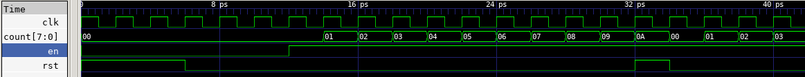
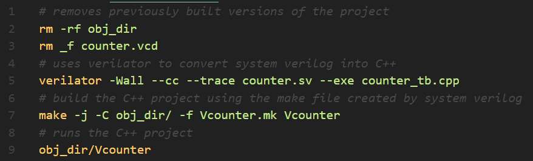
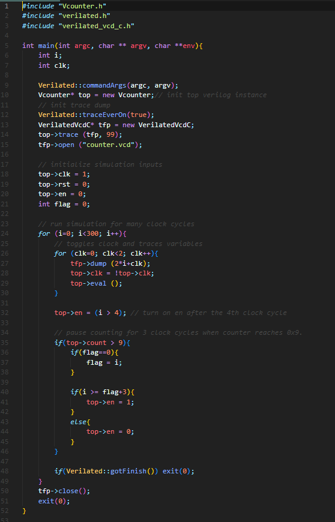
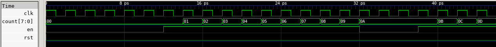
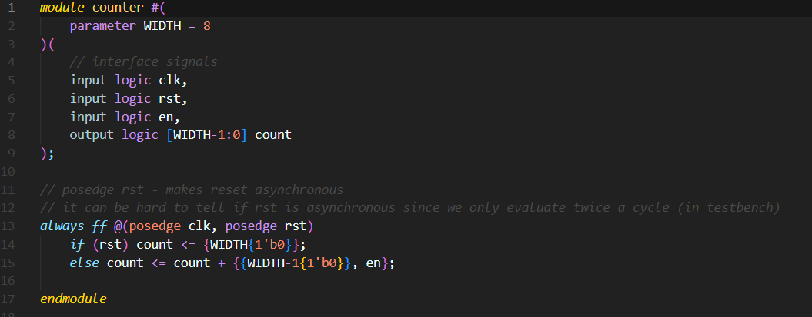
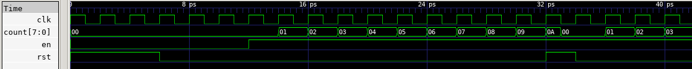
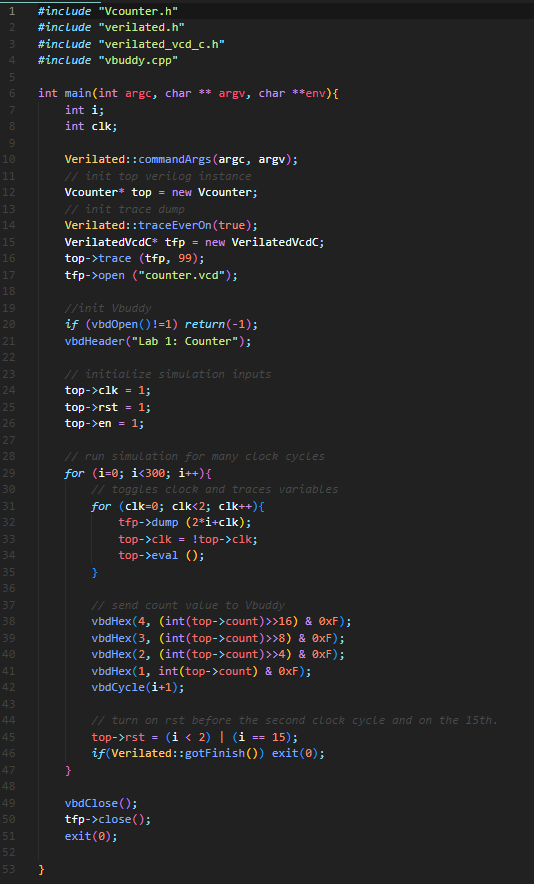
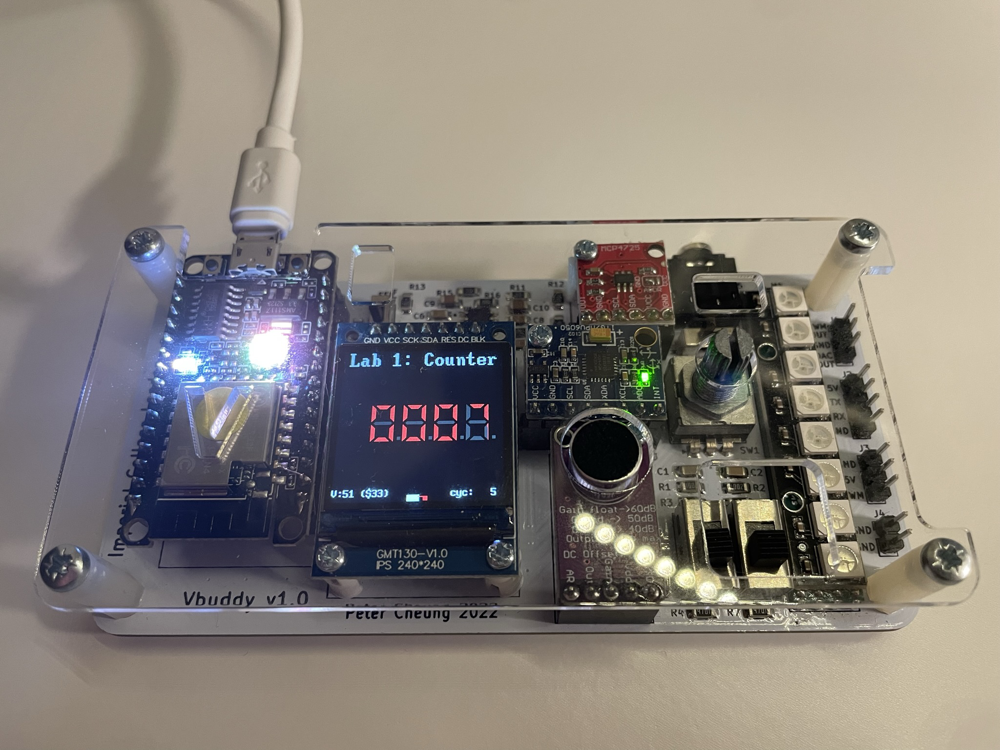
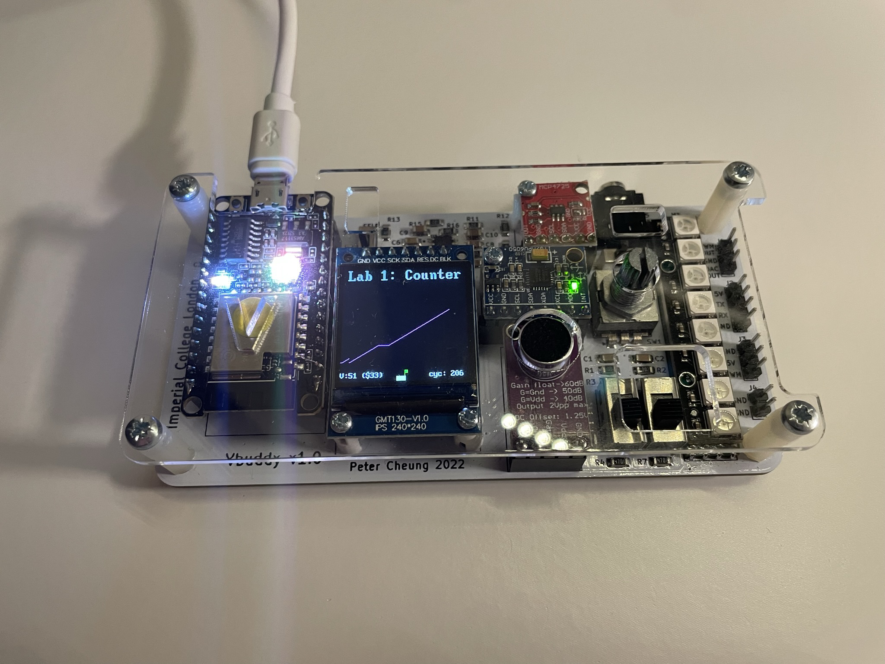

# Lab 1 Logbook: Making a Counter

## Task 1: Simulating a Basic 8-Bit Binary Counter

After cloning the Lab1-Counter repository on my device, the first step was to write the following system verilog module (counter.sv):\

\
When this is synthesized using Verilator it should yield the following hardware:\

\
Next, I must create a testbench file in C++, this will be called "counter_tb.cpp" and is also provided to us:\

\
Then I use the following command which uses Verilator to convert System Verilog into C++, including the testbench file:\
  ```verilator -Wall --cc --trace counter.sv --exe counter_tb.cpp```
This will create a new folder called "obj_dir", to hold a number of new files, including a "make" file entitled ```Vcounter.mk```.

Next, I run the following command, which uses the previously created "make" file to build the C++ project and produce the executable file ```Vcounter```.\
  ```make -j -C obj_dir/ -f Vcounter.mk Vcounter```
\
This file can then be run with the following command:\
  ```obj_dir/Vcounter```

I can visualize the waveforms present in my project using the program "GTKwave".
Running this required me to download an "Xserver" for Windows - this is a complication of using a virtual machine, which wouldn't be present had I been running Linux natively.
I also had to set the ```DISPLAY``` environment variable using the following command:
```export DISPLAY=:0```\
When I run GTKwave, I open the file "Vcounter.vcd" and can see the following waveforms:\

\
As you can see, the clock signal oscillates between high and low as expected and the enable signal is set to high after 4 clock cycles.
The reset signal is high before clock cycle 2 and high again in the 15th clock cycle, the count signal increments as expected, responding to the changes in the enable and reset signals.

Before starting the next task, I am going to create a Linux shell script to automate the terminal commands required to convert my System Verilog files into executables.
This new file can be seen below:\
\
And can be run using:
  ```source ./doit.sh```

### Challenge
The first challenge is to modify the testbench file, so that the counter waits at the value 0x9 for 3 clock cycles and then resumes counting.
This can be achieved, by introducing a new variable ```flag``` and disabling the previous conditions on the reset signal, as shown below:\


When we re-view the signals on GTKwave, we see exactly what we would expect:


The next challenge is to change the current counters synchronous reset to an asynchronous reset.
This can be done, by adding a second condition to the ```always_ff``` block, as shown:

\
The synchronous and asynchronous waveforms are shown below:\
**Synchronous**

\
**Asynchronous**

\
In the asynchronous waveform it takes only half a cycle for the count signal to reset to 0. In actual hardware, this would be instant - we see the half-cycle delay because we are only polling the state of the system twice a cycle.


## Task 2: Linking the Verilator Simulation with Vbuddy
Before starting this task, some setup was required to allow WSL USB access, for communication with Vbuddy.

Once I had done this, I modified the testbench file as shown below, to display the counter on Vbuddy's LCD screen.\

\
A photo of Vbuddy displaying the count can be seen below:\
\
\
Next, I added the following line, which allows me to control the enable signal (stopping and starting the counter) using Vbuddy's rotary button.\
```top->en = vbdFlag();```
\
Running this on Vbuddy confirmed it functioned.\

Next, I replaced the "vbdHex" functions, with the following "vbdPlot" function, which outputs the counters value as the value on a graph:\
  ```vbdPlot(int(top->count), 0, 255);```
An image of this running on Vbuddy can be seen below:\
\
\
The flat in the curve shows the rotary button being used to "hold" the counter.


