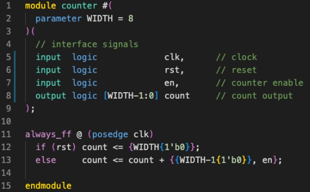
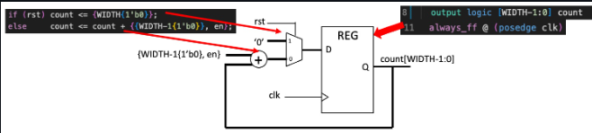
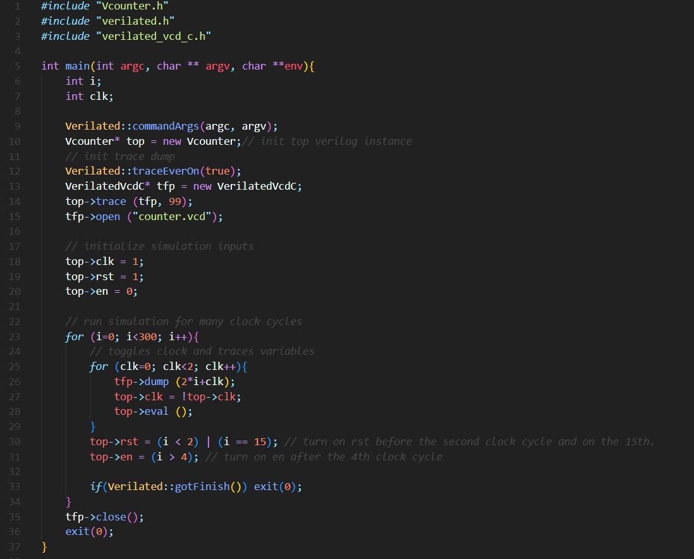

# Lab 1 Logbook: Making a Counter

## Task 1: Simulating a Basic 8-Bit Binary Counter

After cloning the Lab1-Counter repository on my device, the first step was to write the following system verilog module (counter.sv):\

\
When this is synthesized using Verilator it should yield the following hardware:\

\
Next, I must create a testbench file in C++, this will be called "counter_tb.cpp" and is also provided to us:\

\
Then I use the following command which uses Verilator to convert System Verilog into C++, including the testbench file:\
  ```verilator -Wall --cc --trace counter.sv --exe counter_tb.cpp```
This will create a new folder called "obj_dir", to hold a number of new files, including a "make" file entitled ```Vcounter.mk```.

Next, I run the following command, which uses the previously created "make" file to build the C++ project and produce the executable file ```Vcounter```.\
  ```make -j -C obj_dir/ -f Vcounter.mk Vcounter```
\
This file can then be run with the following command:\
  ```obj_dir/Vcounter```

I can visualize the waveforms present in my project using the program "GTKwave".
Running this required me to download an "Xserver" for Windows - this is a complication of using a virtual machine, which wouldn't be present had I been running Linux natively.
I also had to set the ```DISPLAY``` environment variable using the following command:
```export DISPLAY=:0```\
When I run GTKwave, I open the file "Vcounter.vcd" and can see the following waveforms:

IMAGE

As you can see (explain waveforms to validate they work)

Before starting the next task, I am going to create a Linux shell script to automate the terminal commands required to convert my System Verilog files into executables.
This new file can be seen below:
  IMAGE
And can be run using:
  source ./doit.sh

### Challenge
The first challenge is to modify the testbench file, so that the counter waits at the value 0x9 for 3 clock cycles and then resumes counting.
This can be achieved with the following modifications:
  IMAGE

The next challenge is to change the current counters synchronous reset to an asynchronous reset.
This can be done as shown:
  IMAGE


## Task 2: Linking the Verilator Simulation with Vbuddy
Before starting this task, some setup was required to allow WSL USB access, for communication with Vbuddy.

Once I had done this, I modified the testbench file as shown below, to display the counter on Vbuddy's LCD screen.
  IMAGE
A photo of Vbuddy displaying the count can be seen below:
  IMAGE

Next, I added the following line, which allows me to control the enable signal (stopping and starting the counter) using Vbuddy's rotary button.
  IMAGE
Running this on Vbuddy confirmed it functioned.

Next, I replaced the "vbdHex" functions, with the following "vbdPlot" function, which outputs the counters value as the value on a graph:
  IMAGE
An image of this running on Vbuddy can be seen below:
  IMAGE


